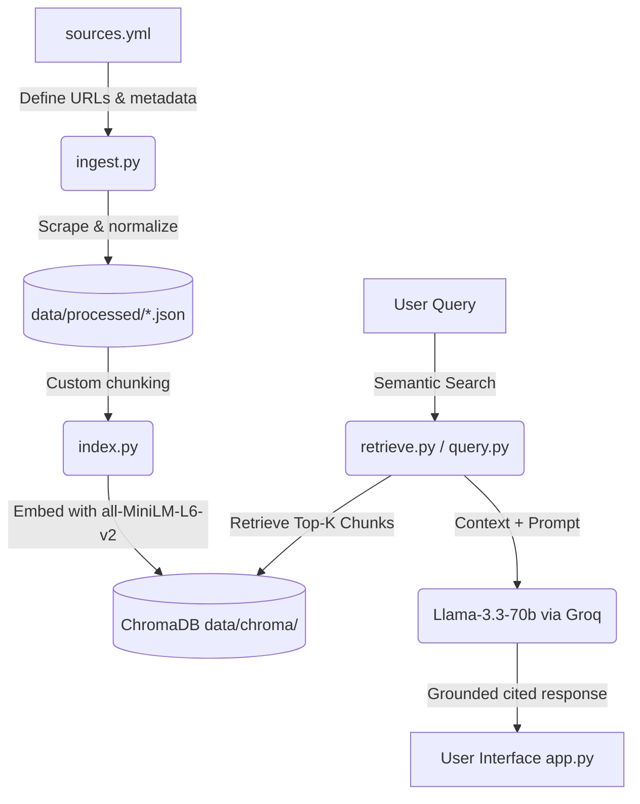

# Project 1 Planning: The Unofficial Guide

> Write this document before you write any pipeline code.
> Your spec and architecture diagram are what you'll use to direct AI tools (Claude, Copilot, etc.) to generate your implementation — the more specific they are, the more useful the generated code will be.
> Update the Retrieval Approach and Chunking Strategy sections if you change your approach during implementation.
> Update this file before starting any stretch features.

---

## Domain

The system covers **Columbia University dining and meal plans for graduate students** on the Morningside Heights campus. 

This knowledge is highly valuable because:
- Official Columbia Dining pages often describe dining plans broadly, leaving graduate-specific options, pricing, and caps (such as term block limitations) buried across different subpages.
- Crucial location-based restrictions (e.g., that graduate meal plans are restricted to select retail spots and do not work at popular residential dining halls like John Jay or Ferris) are only explicitly discussed or summarized in unofficial student communities like Reddit.
- This guide makes this scattered information searchable, providing grad students with objective answers regarding plans, convenience (especially for engineering students near Mudd), and cost-effectiveness.

---

## Documents

| # | Source | Description | URL or location |
|---|--------|-------------|-----------------|
| 1 | Columbia Dining Main Site | General list of dining halls and retail spots. | https://dining.columbia.edu |
| 2 | Dining Plan Policy | Official Columbia policies regarding meal plan terms and changes. | https://dining.columbia.edu/content/dining-plan-policy |
| 3 | Spring 2026 Change Period | Official announcement of the spring semester meal plan modification window. | https://dining.columbia.edu/news/spring-2026-dining-plan-change-period-january-13-27 |
| 4 | Engineering Dining (SEAS Guide) | Dining locations near the engineering building (Mudd). | https://www.engineering.columbia.edu/student-life/dining |
| 5 | First-Year Dining Plans | Undergraduate first-year meal plan options (for context and comparison). | https://dining.columbia.edu/content/first-year-dining-plans |
| 6 | Graduate Student Dining Plans | Official description of graduate dining plan structures and prices. | https://dining.columbia.edu/graduate-plans |
| 7 | WikiCU: Dining Services | Student-run wiki detailing dining halls, history, and location hours. | https://www.wikicu.com/Dining_Services |
| 8 | WikiCU: Meal plan | Student wiki page reviewing the history and structure of meal plans. | https://www.wikicu.com/Meal_plan |
| 9 | Prked 2025–26 Meal Plan Guide | Third-party student guide summarizing meal plan options and advice. | https://prked.com/post/columbia-university-meal-plan-guide-a-deep-dive-for-2025-26 |
| 10 | Reddit: Grad dining policy change | Thread detailing the shift restricting grad students from residential halls. | https://www.reddit.com/r/columbia/comments/1mylwoa/columbia_dinings_new_policy_regarding_graduate/ |
| 11 | Reddit: Buying extra meals | Discussion about options if students run out of term block swipes. | https://www.reddit.com/r/columbia/comments/197mdia/can_you_add_more_meals_to_the_meal_plan_if_i_run/ |
| 12 | Reddit: Dining halls experiences | General student experiences and reviews of campus dining locations. | https://www.reddit.com/r/columbia/comments/1tct9ad/dining_halls/ |
| 13 | Student Dining Plans Index | Directory index of official dining plan options. | https://dining.columbia.edu/student-dining-plans |

---

## Chunking Strategy

**Chunk size:** Tailored by document type: Location-level or Comment-level where applicable, and 1200 characters (~300 tokens) for standard policy pages and guides.

**Overlap:** 150 characters (only for paragraph-based chunks).

**Reasoning:** We design specific chunking strategies based on document structure to preserve semantic coherence:
- **Reddit Threads (S10–S12)**: Split at comment/post boundaries using OP/Comment header indicators so each review or student reply stays complete.
- **Location Lists (S4, S7)**: Split by numbered location headers so each food hall/cafe is a single chunk, preventing Mudd-adjacent locations from being mixed.
- **Policies/Guides (S1–S3, S5, S6, S8, S9, S13)**: Standard character-based splitting with a 150-char overlap to capture contiguous items like dining change rules or price brackets without losing context at boundaries.

---

## Retrieval Approach

**Embedding model:** `sentence-transformers/all-MiniLM-L6-v2`

**Top-k:** 5

**Production tradeoff reflection:** If cost was not a constraint, we would weigh:
- **Context Length**: Local MiniLM has a 256-token limit. A production model with larger limits (e.g. 8192 tokens) would allow us to index larger tables or entire comment threads in a single chunk.
- **Accuracy**: Larger models capture finer domain-specific details and academic abbreviations (e.g., distinguishing "SEAS" from "seas").
- **Multilingual Support**: Essential for international graduate students who might search or ask questions in other languages.
- **Latency vs. Cost**: Running embeddings locally has zero API latency and zero cost, which is ideal for a free-tier prototype. For production, API-based embeddings require scaling and handling rate limits.

---

## Evaluation Plan

| # | Question | Expected answer |
|---|----------|-----------------|
| 1 | What is the structure of the current meal plan options for graduate students, and how do they differ from the older '14 meals per week' style plans? | Graduate students can only select term block options (25, 50, or 75 meals per term) restricted to retail locations (not residential halls). This differs from older plans which offered weekly structures like 14 meals per week. |
| 2 | Can graduate students use their meal plans at John Jay, Ferris, or JJ's? | No, graduate plans cannot be used at traditional residential dining halls (John Jay, Ferris, JJ's). They are restricted to select retail locations. |
| 3 | What happens if I run out of meals before the end of the term? Can I buy more? | Yes, you can purchase 10-meal expansion packs for $110. GS students can also request up to 6 emergency meal tickets from the GS Student Senate. |
| 4 | If I have most of my classes in Mudd, which on-campus dining locations are most convenient for grabbing lunch? | Blue Java Café in Mudd, Chef Don's Pizza Pi in Mudd, Chef Mike's Sub Shop in Uris, and Faculty House. |
| 5 | As an off-campus SEAS grad student, is it worth it to buy a graduate meal plan, or should I just pay per meal or cook at home? | Buying a plan does not save money and locks you into a contract, so paying per meal or cooking at home is generally better, especially given retail location limits. |

---

## Anticipated Challenges

1. **Cloudflare Blocking & 403 Errors**: Official Columbia Dining and Reddit pages block standard python scraper requests. We resolve this by building a robust fallback mechanism in `ingest.py` to use curated pre-scraped text when blocked.
2. **Context Dilution / Over-fragmentation**: Fragmenting location lists into individual small chunks causes retrieval to miss related options. We mitigate this by grouping location details or optimizing top-k.

---

## Architecture

Below is the data flow diagram for the Columbia Grad Dining Unofficial Guide RAG pipeline:

---

## AI Tool Plan

**Milestone 3 — Ingestion and chunking:**
- **Tool**: Antigravity (Google DeepMind's Advanced Agentic Coding Assistant)
- **Input**: Documents and Chunking Strategy sections of `planning.md`.
- **Expected Output**: Ingestion script `ingest.py` implementing HTML cleaning, tag removal, and regex-based comment/location splitting.
- **Verification**: Inspect the printed clean output and verify final chunk count matches expected distributions.

**Milestone 4 — Embedding and retrieval:**
- **Tool**: Antigravity (Google DeepMind's Advanced Agentic Coding Assistant)
- **Input**: Retrieval Approach section and Architecture diagram of `planning.md`.
- **Expected Output**: `index.py` and `retrieve.py` scripts using `sentence-transformers` and ChromaDB.
- **Verification**: Run semantic query checks and check that similarity distances for top results are under 0.5.

**Milestone 5 — Generation and interface:**
- **Tool**: Antigravity (Google DeepMind's Advanced Agentic Coding Assistant)
- **Input**: Grounded Answer Generation prompt specs and Gradio skeleton requirements.
- **Expected Output**: `query.py` and `app.py` implementing LLM-grounded prompt templates and a clean interface.
- **Verification**: Validate responses with test queries to confirm strict citation of Source IDs and no hallucinated information outside the context.